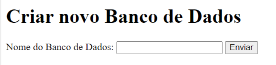
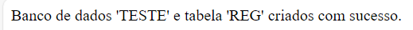

# Sistema CRUD (Create, Read, Update, Delete)

Este é um sistema CRUD (Create, Read, Update, Delete) desenvolvido em PHP e MySQL. Ele permite criar, ler, atualizar e excluir registros em um banco de dados.

## Professor: Felipe
### Disciplina: Algoritmos e técnicas de programação
### Aluno: Natan Gomes Biazon | Dev. Web - PHP

## Requisitos

Antes de começar, verifique se você atende aos seguintes requisitos:

- Instale o XAMPP OU WampServer
- PHP 8.0 ou superior
- MySQL 5.6 ou superior

## Instalação

1. Clone ou faça o download deste repositório.

2. Configure o ambiente de desenvolvimento:

   - Certifique-se de que seu servidor web (por exemplo, Apache) esteja em execução.
   - Configure as informações do banco de dados no arquivo `config.php`.

3. Abra o sistema em seu navegador, por exemplo, `http://localhost/seu-diretorio`.

## Uso

- Acesse o Index.php e defina o nome do banco de dados no campo:
, 
- Após definir o nome, os banco de dados, a tabela definida como REG e as colunas serão criados automatimamente.

Aqui estão as principais funcionalidades do sistema:

- **Criar Registro:** Para criar um novo registro, preencha o formulário na página inicial e clique em "Enviar".

- **Ler Registro:** A página inicial exibe todos os registros atualmente armazenados no banco de dados.

- **Atualizar Registro:** Clique no botão "Editar" ao lado de um registro para abrir uma janela de edição. Faça as alterações necessárias e clique em "Salvar".

- **Excluir Registro:** Clique no botão "Excluir" ao lado de um registro para excluí-lo.

## Contribuição

Sinta-se à vontade para contribuir com melhorias, correções de bugs ou novos recursos. Basta fazer um fork deste repositório, fazer as alterações e criar uma solicitação pull.

## Licença

Este projeto não é licenciado.

## Autor

[Natan Gomes | LinkedIn](https://www.linkedin.com/company/criactivedesign)

 

[Natan Gomes | Instagram](https://www.instagram.com/criactivedesign)

## Contato

Para mais informações ou dúvidas, entre em contato em [comercial@criactivedesign.com.br].

